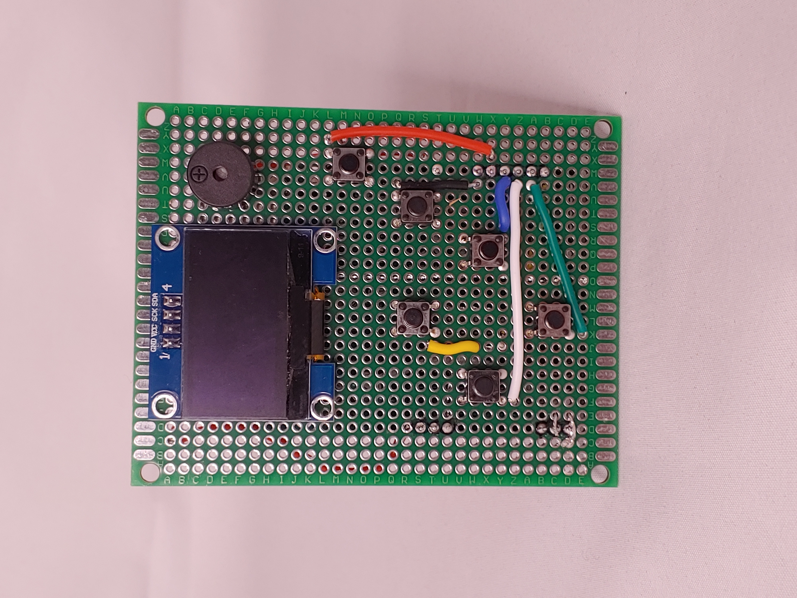
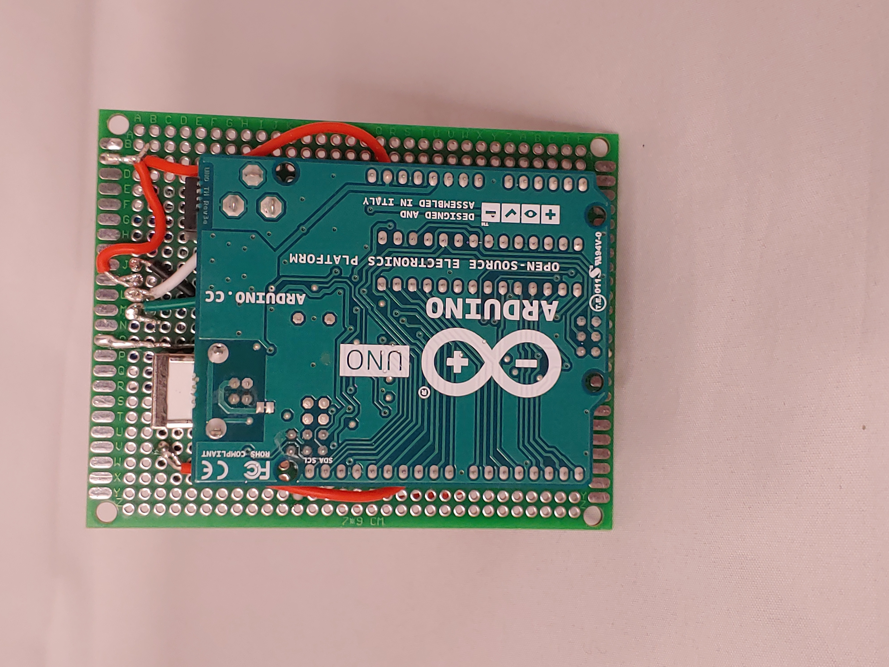
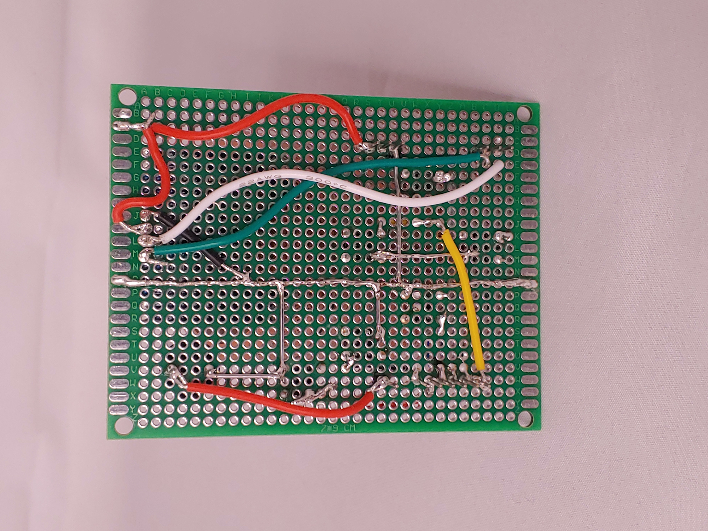

# Arduino Game Console

A DIY handheld gaming console using an Arduino Uno, OLED screen, six buttons, and a passive buzzer. This project demonstrates low-level game logic, sound generation, and real-time input handling with u8g2 graphics.

## 🕹️ Features

- 6 physical buttons: Up, Down, Left, Right, A, B
- Passive buzzer for sound effects and feedback
- 128x64 OLED display using I2C communication
- Custom games using the u8g2lib graphics library
- Built on Arduino Uno (ATmega328P)

## 🔌 Hardware Setup

| Component         | Details                     |
|------------------|-----------------------------|
| Microcontroller  | Arduino Uno                 |
| Display          | 0.96" OLED 128x64 I2C       |
| Audio            | Passive buzzer (pin D9)     |
| Buttons          | 6 digital pins (w/ pull-down resistors) |

## 🧱 Project Structure

```
arduino-game-console/
├── README.md
├── game_main.ino
├── wiring_diagram.png
└── assets/
    └── icons/graphics if needed
```

## 📷 Demo



## 📸 Photo Gallery

| Top View | Side View | Powered On |
|----------|-----------|------------|
|  |  |  |


## 🔧 Libraries Used

- `u8g2lib` for graphics
- `tone()` for buzzer audio
- `digitalRead()` for inputs

## 🔄 Future Ideas

- Add more sound effects
- Flash memory save system
- Game menu / level selector
- Include joystick module

## 🧠 Author

Quantum Richardson  
[GitHub Profile](https://github.com/MadTech25)
